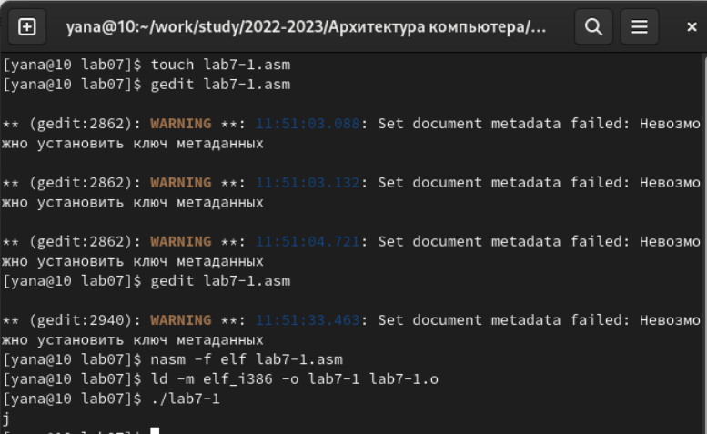
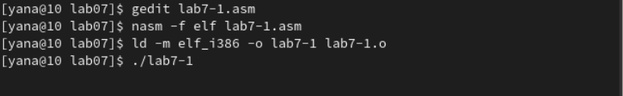
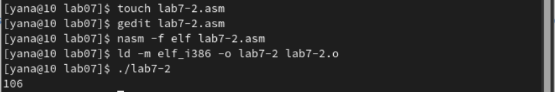
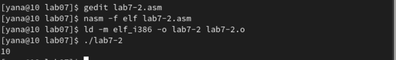
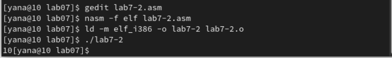
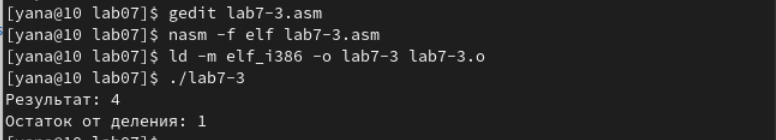
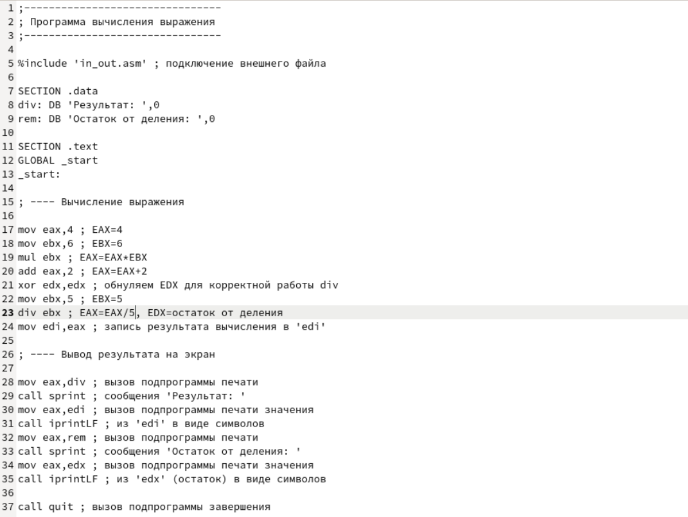
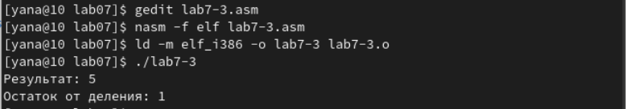
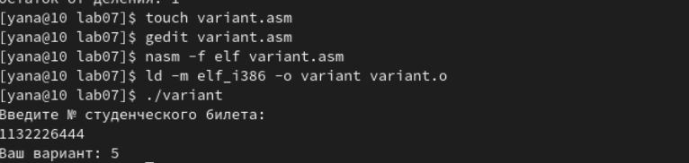
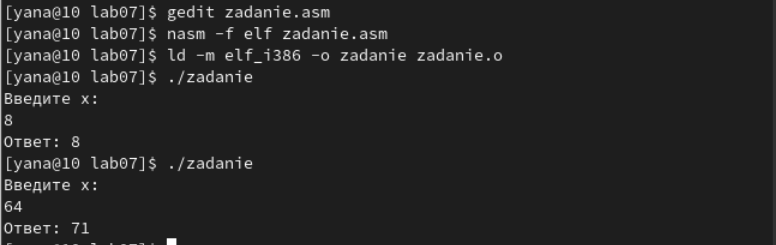

---
## Front matter
title: "Лабораторная работа №7" 
subtitle: "Дисциплина: Архитектура компьютера"
author: "Александрова Ульяна Вадимовна"

## Generic otions
lang: ru-RU
toc-title: "Содержание"

## Bibliography
bibliography: bib/cite.bib
csl: pandoc/csl/gost-r-7-0-5-2008-numeric.csl

## Pdf output format
toc: true # Table of contents
toc-depth: 2
lof: true # List of figures
lot: true # List of tables
fontsize: 12pt
linestretch: 1.5
papersize: a4
documentclass: scrreprt
## I18n polyglossia
polyglossia-lang:
  name: russian
  options:
	- spelling=modern
	- babelshorthands=true
polyglossia-otherlangs:
  name: english
## I18n babel
babel-lang: russian
babel-otherlangs: english
## Fonts
mainfont: PT Serif
romanfont: PT Serif
sansfont: PT Sans
monofont: PT Mono
mainfontoptions: Ligatures=TeX
romanfontoptions: Ligatures=TeX
sansfontoptions: Ligatures=TeX,Scale=MatchLowercase
monofontoptions: Scale=MatchLowercase,Scale=0.9
## Biblatex
biblatex: true
biblio-style: "gost-numeric"
biblatexoptions:
  - parentracker=true
  - backend=biber
  - hyperref=auto
  - language=auto
  - autolang=other*
  - citestyle=gost-numeric
## Pandoc-crossref LaTeX customization
figureTitle: "Рис."
tableTitle: "Таблица"
listingTitle: "Листинг"
lofTitle: "Список иллюстраций"
lotTitle: "Список таблиц"
lolTitle: "Листинги"
## Misc options
indent: true
header-includes:
  - \usepackage{indentfirst}
  - \usepackage{float} # keep figures where there are in the text
  - \floatplacement{figure}{H} # keep figures where there are in the text
---

# Цель работы

Целью лабораторной работы является освоение арифметических инструкций языка ассемблера NASM.

# Выполнение лабораторной работы

Создаю каталог lab07 и перехожу туда. В каталоге создаю файл *lab7-1.asm* и редактирую в текстовом редакторе так, чтобы текст соответствовал предложенному листингу. Создаю исполняемый файл и запускаю  программу (рис. [-@fig:001]).

{ #fig:001 width=70% }

Далее заменяю в программе символы '6' и '4' на 6 и 4, а затем запускаю программу. На экран был выведен символ перевода строка с кодом 10 (рис. [-@fig:002]).

{ #fig:002 width=70% }

Создаю новый файл *lab7-2.asm* и ввожу в него текст программы из листинга 7.2. В результате работы программы получаю число 106 (рис. [-@fig:003]).

{ #fig:003 width=70% }

Заменяю символы на числа и при запуске программы получаю число 10, тк система складывает числа, а не коды, соответствующие данным символам (рис. [-@fig:004]).

{ #fig:004 width=70% }

Меняю функцию iprintLF на iprint. В результате запуска программы видно, что система не перешла на новую строку (рис. [-@fig:005]).

{ #fig:005 width=70% }

Создаю файл *lab7-3.asm* и ввожу в него текст из листинга 7.3 (рис. [-@fig:006]).

{ #fig:006 width=70% }

Изменяю текст файла для соответствия заданию (рис. [-@fig:007]).

{ #fig:007 width=70% }

Запускаю файл и получаю результат (рис. [-@fig:008]).

{ #fig:008 width=70% }

Создаю файл *variant.asm* и вношу текст из листинга 7.4 в него. В результате запуска программы получаю свой вариант (рис. [-@fig:009]).

{ #fig:009 width=70% }

1. За вывод сообщения "Ваш вариант" отвечают данные строки кода

```NASM
mov eax,rem
call sprint
```

2. *mov ecx, x* используется для того, чтобы положить адрес вводимой пользователем строки в регистр ecx.
*mov edx,80* -- запись длины видимой строки.
*call sread* -- вызов подпрограммы из файла.

3. Инструкция используется для вызова подпрограммы, преобразующей код символа (ASCII) в целое число, а также записывает результат в регистр eax.

4. За вариант отвечают строки

```NASM
xor edx,edx ; обнуление edx для корректной работы div
mov ebx,20 ; ebx = 20
div ebx ; eax = eax/20, edx - остаток от деления
inc edx ; edx = edx + 1
```

5. Остаток от деления записывается в регистр edx.

6. инструкция *inc edx* используется для увеличения значения в регистре edx на один.

7. За вывод на экран результатов отвечают строки

```NASM
mov eax,edx
call iprintLF
```

# Задание для самостоятельной работы

Я создала файл *zadanie.asm* и заполнила программу в соответствии с моим вариантом (рис. [-@fig:010]).

```NASM
%include 'in_out.asm'

SECTION .data
msg: DB 'Введите x: ',0
rem: DB 'Ответ: ',0

SECTION .bss
x: RESB 80
SECTION .text
GLOBAL _start

_start:
mov eax, msg
call sprintLF
mov ecx, x
mov edx, 80
call sread
mov eax,x ; вызов подпрограммы преобразования
call atoi ; ASCII кода в число, `eax=x`
mov ebx,9
mul ebx
sub eax,8
mov ebx,8
div ebx
xor ebx, ebx
mov edi, eax

mov eax, rem
call sprint ; сообщения 'Результат: '
mov eax,edi ; вызов подпрограммы печати значения
call iprintLF ; из 'edi' в виде символов

call quit ; вызов подпрограммы завершения
```

{ #fig:010 width=70% }

# Выводы

Я освоила арифметические инструкции языка ассемблер NASM.
