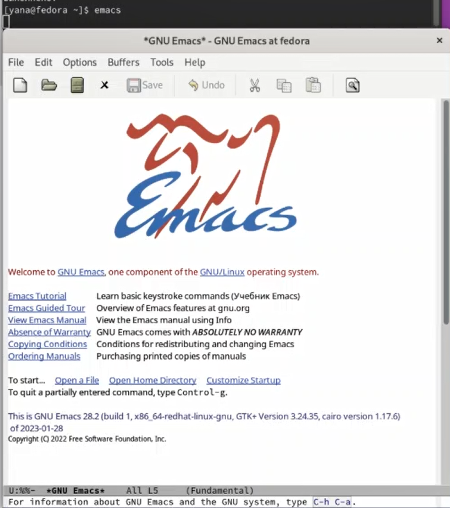
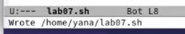
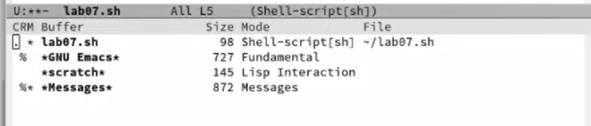
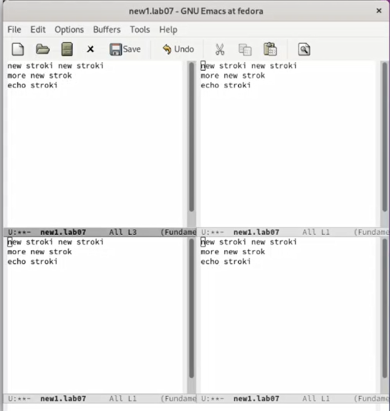
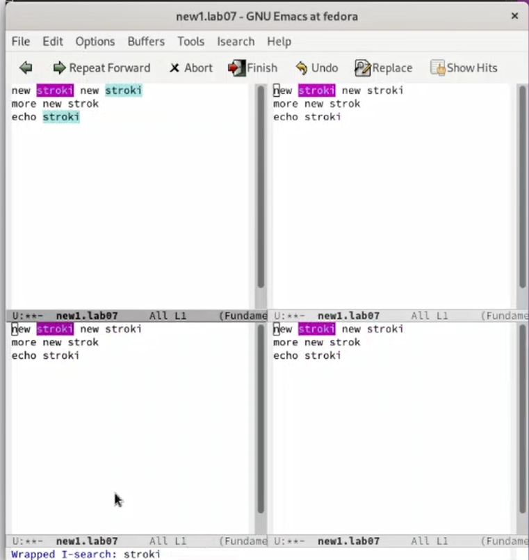

---
## Front matter
lang: ru-RU
title: Лабораторная работа №9
subtitle: Операционные системы
author:
  - Александрова У. В.
institute:
  - Российский университет дружбы народов, Москва, Россия
date: 8 апреля 2023

## i18n babel
babel-lang: russian
babel-otherlangs: english

## Formatting pdf
toc: false
toc-title: Содержание
slide_level: 2
aspectratio: 169
section-titles: true
theme: metropolis
header-includes:
 - \metroset{progressbar=frametitle,sectionpage=progressbar,numbering=fraction}
 - '\makeatletter'
 - '\beamer@ignorenonframefalse'
 - '\makeatother'
---

# Информация

## Докладчик

  * Александрова Ульяна
  * студентка 1-го курса
  * Российский университет дружбы народов

# Цель работы

## Цель работы

Целью работы является ознакомление с операционной системой Linux. Получение практические навыки работы с редактором Emacs.

## Задание

1. Ознакомиться с теоретическим материалом.
2. Ознакомиться с редактором emacs.
3. Выполнить упражнения.
4. Ответить на контрольные вопросы.

## Теоретическое введение

Буфер — объект, представляющий какой-либо текст.

Буфер может содержать что угодно, например, результаты компиляции программы
или встроенные подсказки. Практически всё взаимодействие с пользователем, в том
числе интерактивное, происходит посредством буферов.

## Теоретическое введение

Определение 2. Фрейм соответствует окну в обычном понимании этого слова. Каждый
фрейм содержит область вывода и одно или несколько окон Emacs.

## Выполнение лабораторной работы

Я открыла emacs.

{#fig:001 width=70%}

## Выполнение лабораторной работы

Я создала файл lab07.sh с помощью комбинации Ctrl-x Ctrl-f.

{#fig:002 width=70%}

## Выполнение лабораторной работы

Набрала предложенный текст и сохранила файл.

{#fig:003 width=70%}

## Выполнение лабораторной работы

Проделала с текстом стандартные процедуры редактирования:
5.1. Вырезать одной командой целую строку (С-k).  
5.2. Вставить эту строку в конец файла (C-y).  
5.3. Выделить область текста (C-space).  
5.4. Скопировать область в буфер обмена (M-w).  
5.5. Вставить область в конец файла.  
5.6. Вновь выделить эту область и на этот раз вырезать её (C-w).  
5.7. Отмените последнее действие (C-/).

## Выполнение лабораторной работы

Научилась использовать команды по перемещению курсора.

Вывела список активных буферов на экран, переключилась между ними.

{#fig:004 width=70%}

## Выполнение лабораторной работы

Поделила фрейм на 4 части, открыла буфер и ввела текст.

{#fig:005 width=70%}

## Выполнение лабораторной работы

Переключилась в режим поиска (C-s) и нашла несколько слов, присутствующих в тексте.

{#fig:006 width=70%}

## Выводы

Я ознакомилась с операционной системой Linux. Получила практические навыки работы с редактором Emacs.

:::
