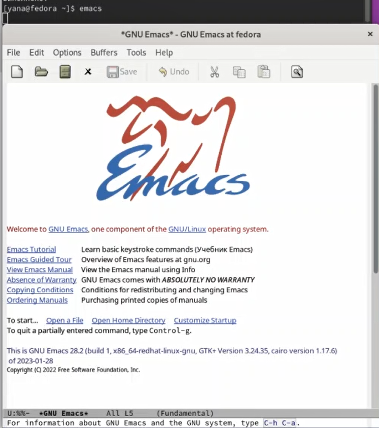
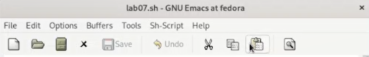
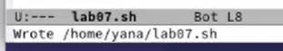
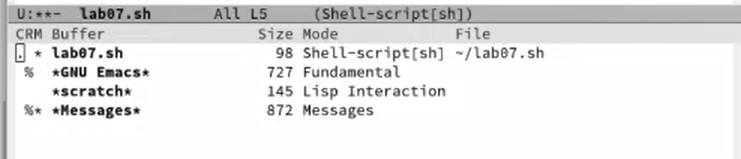
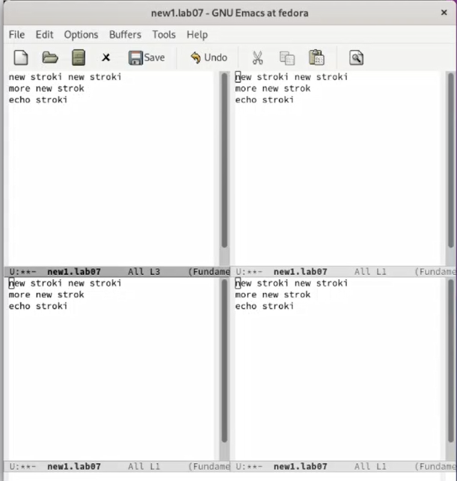
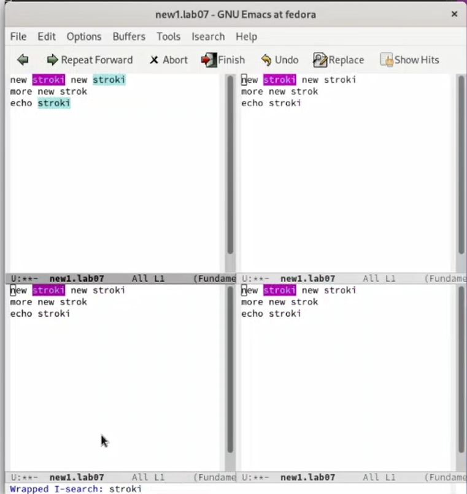

---
## Front matter
title: "Лабораторная работа №9"
subtitle: "Операционные системы"
author: "Александрова Ульяна"

## Generic otions
lang: ru-RU
toc-title: "Содержание"

## Bibliography
bibliography: bib/cite.bib
csl: pandoc/csl/gost-r-7-0-5-2008-numeric.csl

## Pdf output format
toc: true # Table of contents
toc-depth: 2
lof: true # List of figures
lot: true # List of tables
fontsize: 12pt
linestretch: 1.5
papersize: a4
documentclass: scrreprt
## I18n polyglossia
polyglossia-lang:
  name: russian
  options:
	- spelling=modern
	- babelshorthands=true
polyglossia-otherlangs:
  name: english
## I18n babel
babel-lang: russian
babel-otherlangs: english
## Fonts
mainfont: PT Serif
romanfont: PT Serif
sansfont: PT Sans
monofont: PT Mono
mainfontoptions: Ligatures=TeX
romanfontoptions: Ligatures=TeX
sansfontoptions: Ligatures=TeX,Scale=MatchLowercase
monofontoptions: Scale=MatchLowercase,Scale=0.9
## Biblatex
biblatex: true
biblio-style: "gost-numeric"
biblatexoptions:
  - parentracker=true
  - backend=biber
  - hyperref=auto
  - language=auto
  - autolang=other*
  - citestyle=gost-numeric
## Pandoc-crossref LaTeX customization
figureTitle: "Рис."
tableTitle: "Таблица"
listingTitle: "Листинг"
lofTitle: "Список иллюстраций"
lotTitle: "Список таблиц"
lolTitle: "Листинги"
## Misc options
indent: true
header-includes:
  - \usepackage{indentfirst}
  - \usepackage{float} # keep figures where there are in the text
  - \floatplacement{figure}{H} # keep figures where there are in the text
---

# Цель работы

Целью работы является ознакомление с операционной системой Linux. Получение практические навыки работы с редактором Emacs.

# Задание

1. Ознакомиться с теоретическим материалом.
2. Ознакомиться с редактором emacs.
3. Выполнить упражнения.
4. Ответить на контрольные вопросы.

# Теоретическое введение

Определение 1. Буфер — объект, представляющий какой-либо текст.

Буфер может содержать что угодно, например, результаты компиляции программы
или встроенные подсказки. Практически всё взаимодействие с пользователем, в том
числе интерактивное, происходит посредством буферов.

Определение 2. Фрейм соответствует окну в обычном понимании этого слова. Каждый
фрейм содержит область вывода и одно или несколько окон Emacs.

Определение 3. Окно — прямоугольная область фрейма, отображающая один из буферов.
Каждое окно имеет свою строку состояния, в которой выводится следующая информация: название буфера, его основной режим, изменялся ли текст буфера и как далеко вниз по буферу расположен курсор. Каждый буфер находится только в одном из возможных
основных режимов. Существующие основные режимы включают режим Fundamental
(наименее специализированный), режим Text, режим Lisp, режим С, режим Texinfo и другие. Под второстепенными режимами понимается список режимов, которые включены в данный момент в буфере выбранного окна.

Определение 4. Область вывода — одна или несколько строк внизу фрейма, в которой
Emacs выводит различные сообщения, а также запрашивает подтверждения и дополнительную информацию от пользователя.

Определение 5. Минибуфер используется для ввода дополнительной информации и всегда отображается в области вывода.

Определение 6. Точка вставки — место вставки (удаления) данных в буфере.

# Выполнение лабораторной работы

Я открыла emacs (рис. @fig:001).

{#fig:001 width=70%}

Я создала файл lab07.sh с помощью комбинации Ctrl-x Ctrl-f (рис. @fig:002).

{#fig:002 width=70%}

Набрала предложенный текст и сохранила файл (рис. @fig:003).

{#fig:003 width=70%}

Проделала с текстом стандартные процедуры редактирования:
5.1. Вырезать одной командой целую строку (С-k).  
5.2. Вставить эту строку в конец файла (C-y).  
5.3. Выделить область текста (C-space).  
5.4. Скопировать область в буфер обмена (M-w).  
5.5. Вставить область в конец файла.  
5.6. Вновь выделить эту область и на этот раз вырезать её (C-w).  
5.7. Отмените последнее действие (C-/).

Научилась использовать команды по перемещению курсора.

Вывела список активных буферов на экран, переключилась между ними (рис. @fig:004).

{#fig:004 width=70%}

Поделила фрейм на 4 части, открыла буфер и ввела текст (рис. @fig:005).

{#fig:005 width=70%}

Переключилась в режим поиска (C-s) и нашла несколько слов, присутствующих в тексте (рис. @fig:006).

{#fig:006 width=70%}

# Выводы

Я ознакомилась с операционной системой Linux. Получила практические навыки работы с редактором Emacs.

# Контрольные вопросы

1. Кратко охарактеризуйте редактор emacs.  
Emacs представляет собой мощный экранный редактор текста, написанный на языке высокого уровня Elisp.
2. Какие особенности данного редактора могут сделать его сложным для освоения новичком?  
Работа в редакторе в основном производится при помощи сочетаний клавиш.
3. Своими словами опишите, что такое буфер и окно в терминологии emacs’а.  
Буфер -- объект, представляющий собой текст. Окно -- область, отображающая буфер.
4. Можно ли открыть больше 10 буферов в одном окне?  
Можно.
6. Какие клавиши вы нажмёте, чтобы ввести следующую комбинацию C-c | и C-c C-|?
Ctrl+C и |, Ctrl+c Ctrl+|
7. Как поделить текущее окно на две части?  
Ctrl+x 3/2
8. В каком файле хранятся настройки редактора emacs?  
~/.emacs
10. Какой редактор вам показался удобнее в работе vi или emacs? Поясните почему
Vi показался удобнее, тк я привыкла к данному интерфейсу.

:::
